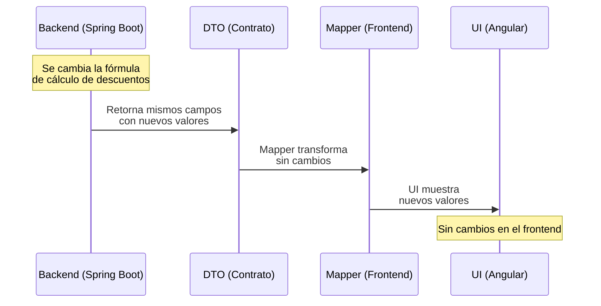

# Documento de Integración Frontend-Backend

**Proyecto:** Sistema de Gestión de Maestría en Computación
**Fecha:** 2026-05-05
**Autor:** Daniel Felipe Contreras Tobar (Frontend)

---

## 1. Visión General de la Integración

El sistema está compuesto por tres repositorios independientes que se comunican mediante APIs REST:

```
┌─────────────────────────────────────────────────────────────────────┐
│                    Sistema Maestría en Computación                   │
│                                                                       │
│  ┌──────────────────────┐    HTTP/REST    ┌──────────────────────┐  │
│  │  ms-maestriacompu-   │ ─────────────► │  ms-matricula-       │  │
│  │  tacion-front        │                │  financiera          │  │
│  │  Angular 13          │                │  Spring Boot 3       │  │
│  │  Puerto: 4200        │                │  Puerto: 8092        │  │
│  │                      │ ─────────────► │                      │  │
│  │                      │    HTTP/REST   │  ms-info-            │  │
│  │                      │                │  presupuestaria      │  │
│  │                      │                │  Spring Boot 3       │  │
│  └──────────────────────┘                │  Puerto: 8080        │  │
│                                           └──────────────────────┘  │
│                                                    │                  │
│                                           ┌────────▼─────────┐      │
│                                           │  BD Compartida   │      │
│                                           │  MySQL           │      │
│                                           │  appmaestria     │      │
│                                           └──────────────────┘      │
└─────────────────────────────────────────────────────────────────────┘
```

### Principio fundamental de la integración

**El backend es el único responsable de la lógica de negocio y los cálculos financieros. El frontend solo presenta los datos que recibe.**

Esto significa que si el Desarrollador Backend cambia la fórmula de cálculo del valor de matrícula, el descuento por beca, o cualquier otro cálculo financiero, el frontend **no requiere ningún cambio** — simplemente muestra los nuevos valores que llegan en los mismos campos del DTO.

---

## 2. Cómo nos pusimos de acuerdo: el proceso de definición de contratos

### 2.1 Flujo de trabajo acordado

El equipo estableció el siguiente proceso antes de comenzar la implementación:

```
1. Backend define el modelo de dominio (entidades Java)
2. Backend expone los DTOs de respuesta (lo que va a retornar)
3. Frontend revisa los DTOs y define sus interfaces TypeScript equivalentes
4. Ambos validan que los campos coincidan
5. Backend implementa la lógica
6. Frontend implementa la presentación
7. Integración y prueba manual conjunta
```

Este proceso garantizó que el frontend nunca dependiera de cómo el backend calcula los valores, solo de qué campos retorna y con qué tipos.

### 2.2 Ejemplo concreto: acuerdo sobre `StudentResponse`

El backend definió en Java:

```java
// ms-matricula-financiera: StudentResponse.java
public class StudentResponse {
    private String codigo;
    private String nombre;
    private String apellido;
    private Long identificacion;
    private Integer cohorte;
    private String periodoIngreso;
    private Integer semestreFinanciero;
    private Integer semestreAcademico;
    private Integer valorEnSMLV;        // ← calculado por el backend
    private Boolean esEgresadoUnicauca;
    private Boolean aplicaVotacion;
    private List<MateriaResponse> materias;
    private List<BecaDescuentoInfoResponse> becasDescuentos;
    private Boolean estaPago;
    private String grupoNombre;
}
```

El frontend definió en TypeScript el equivalente exacto:

```typescript
// ms-maestriacomputacion-front: estudiante.dto.ts
export interface EstudianteDTORespuesta {
    codigo: string;
    nombre: string;
    apellido: string;
    identificacion: number;
    cohorte: number;
    periodoIngreso: string;
    semestreFinanciero: number;
    semestreAcademico?: number;
    valorEnSMLV?: number | null;   // ← el frontend solo lo muestra
    esEgresadoUnicauca?: boolean;
    aplicaVotacion?: boolean;
    becasDescuentos: BecasDTORespuesta[];
    materias: MateriaDTORespuesta[];
    estaPago?: boolean;
}
```

### 2.3 Ejemplo concreto: acuerdo sobre `ProyeccionEstudianteResponse`

El backend definió los campos calculados como parte del DTO de respuesta:

```java
// ms-info-presupuestaria: ProyeccionEstudianteResponse.java
public class ProyeccionEstudianteResponse {
    private String codigoEstudiante;
    private Boolean estaPago;
    private Boolean aplicaVotacion;
    private BigDecimal porcentajeBeca;
    private Boolean aplicaEgresado;
    // Campos calculados por FinancialCalculationService — el frontend NO los recalcula:
    private BigDecimal valorMatricula;
    private BigDecimal valorDescuentoVoto;
    private BigDecimal valorDescuentoBeca;
    private BigDecimal valorDescuentoEgresado;
    private BigDecimal totalDescuentos;
    private BigDecimal valorNeto;
    private BigDecimal totalNetoConDerechos;  // ← valor final que muestra el frontend
}
```

El frontend los recibe y los muestra directamente, sin recalcular. Las becas y descuentos ya vienen con el valor en pesos calculado.


---

## 3. Separación de responsabilidades: qué hace cada capa

### 3.1 Lo que hace el Backend (Spring Boot)

#### ms-matricula-financiera (puerto 8092)

El backend calcula el `valorEnSMLV` de cada estudiante según las reglas del Acuerdo 044/2012 de la Universidad del Cauca. Esta lógica vive en `ManageEnrolledStudentsUseCaseImpl.java`:

```java
// La lógica de negocio está AQUÍ, en el backend — el frontend nunca la ve
private Integer calculateSmlv(Estudiante student) {
    Integer semester = student.getSemestreFinanciero();
    if (semester == null) return null;
    if (semester <= 4) return 6;           // Semestres 1-4: 6 SMLV
    if (semester >= 9) return 1;           // Semestre 9+: 1 SMLV (Acuerdo 044/2012)
    List<Materia> subjects = flatSubjects(student.getMatriculasAcademicas());
    if (subjects.isEmpty()) return 6;
    boolean onlyTg2 = subjects.stream().allMatch(m -> isTg2(m.getMateria()));
    return onlyTg2 ? 1 : 6;               // Solo TG2: 1 SMLV, otras materias: 6 SMLV
}
```

**Si esta regla cambia, el frontend no se modifica.** El frontend solo muestra `valorEnSMLV` como un número.

#### ms-info-presupuestaria (puerto 8080)

El backend calcula todos los valores financieros en `FinancialCalculationService.java`:

```java
// Fórmula completa de cálculo — vive en el backend
BigDecimal valorMatricula = valorSMLV.multiply(BigDecimal.valueOf(smlvs));

// Descuento por voto (acumulable)
BigDecimal descuentoVoto = tieneVoto
    ? valorMatricula.multiply(pctVotacion).setScale(2, RoundingMode.HALF_UP)
    : BigDecimal.ZERO;

// Descuento por beca o egresado (se aplica el mayor)
BigDecimal pctMaximoBeneficio = pctBecaReal.max(pctEgresadoReal);
BigDecimal descuentoAdicional = baseParaOtros.multiply(pctMaximoBeneficio)
    .setScale(2, RoundingMode.HALF_UP);

// Total neto con derechos complementarios
BigDecimal totalNetoConDerechos = netoEstudiante.add(derechosComplementarios);
```

**El frontend recibe `totalNetoConDerechos` ya calculado y lo muestra.** Si la fórmula cambia (por ejemplo, si se agrega un nuevo tipo de descuento), el frontend no cambia nada — el campo `totalNetoConDerechos` sigue existiendo con el nuevo valor.

### 3.2 Lo que hace el Frontend (Angular)

El frontend tiene tres responsabilidades exclusivas:

1. **Presentar los datos** — mostrar los valores calculados por el backend en tablas y formularios.
2. **Capturar entradas del usuario** — recoger los cambios que el usuario quiere hacer (ej. cambiar el porcentaje de beca de un estudiante).
3. **Enviar las entradas al backend** — mandar los datos modificados para que el backend recalcule.

```typescript
// El frontend SOLO envía lo que el usuario cambió
// El backend recalcula TODO y retorna los nuevos valores
export interface ProyeccionEstudianteDTOPeticion {
    codigoEstudiante: string;
    estaPago: boolean;
    aplicaVotacion: boolean;
    porcentajeBeca: number;    // ← Valor nominal (ej. 25.0)
    aplicaEgresado: boolean;
    // NO se envían valorMatricula, descuentos, etc. — el backend los recalcula
}
```


---

## 4. Configuración técnica de la comunicación

### 4.1 CORS — Configuración en el backend

Ambos backends tienen configurado CORS para permitir peticiones desde el frontend Angular en `localhost:4200`. Esto se verificó directamente en el código:

**ms-matricula-financiera — `CorsConfig.java`:**
```java
registry.addMapping("/api/**")
    .allowedOrigins("http://localhost:4200")
    .allowedMethods("GET", "POST", "PUT", "DELETE", "OPTIONS")
    .allowedHeaders("*")
    .allowCredentials(true);
```

**ms-info-presupuestaria — `CorsConfig.java`:**
```java
registry.addMapping("/api/**")
    .allowedOrigins("http://localhost:4200")
    .allowedMethods("GET", "POST", "PUT", "DELETE", "OPTIONS")
    .allowedHeaders("*");
```

### 4.2 Seguridad — JWT compartido

Ambos backends usan el mismo mecanismo de autenticación JWT con `HmacSHA512`. En perfil `dev` todos los endpoints son públicos (`permitAll()`). En perfil `prod` se requiere token JWT válido:

```java
// Mismo patrón en ambos backends — SecurityConfig.java
@Profile("prod")
SecurityFilterChain prodSecurityFilterChain(HttpSecurity http) {
    return http
        .sessionManagement(s -> s.sessionCreationPolicy(SessionCreationPolicy.STATELESS))
        .authorizeHttpRequests(auth -> auth
            .requestMatchers("/actuator/health", "/actuator/info").permitAll()
            .anyRequest().authenticated())
        .oauth2ResourceServer(oauth2 -> oauth2.jwt(jwt -> {}))
        .build();
}
```

El frontend envía el token JWT en cada petición a través del `AuthInterceptor`:

```typescript
// El interceptor agrega el header Authorization automáticamente
// a todas las peticiones HTTP del frontend
```

### 4.3 URLs base — Constantes en el frontend

El frontend centraliza las URLs de los backends en `src/app/core/constants/api-url.ts`:

```typescript
// Las URLs apuntan a los puertos reales de cada microservicio
export const backendGestionMatriculaFinanciera = (path: string) =>
    `http://localhost:8092/api/v1/gestion-matricula-financiera/${path}`;

export const backendInfoPresupuestaria = (path: string) =>
    `http://localhost:8080/api/${path}`;
```

---

## 5. Mapeo completo de endpoints: Backend → Frontend

### 5.1 ms-matricula-financiera (puerto 8092)

| Endpoint Backend (Java) | Método | Endpoint Frontend (TypeScript) | Descripción |
|------------------------|--------|-------------------------------|-------------|
| `StudentController.getStudentsByPeriod()` | POST `/api/v1/gestion-matricula-financiera/estudiantes` | `GestionMatriculaFinancieraApiService.obtenerEstudiantes()` | Lista estudiantes del período |
| `StudentController.getStudentByCode()` | GET `/api/v1/gestion-matricula-financiera/estudiantes/{codigo}` | `GestionMatriculaFinancieraApiService.obtenerEstudiante()` | Detalle de un estudiante |
| `StudentController.tieneDescuentoVoto()` | GET `/api/v1/gestion-matricula-financiera/estudiantes/{codigo}/descuento-voto` | `GestionMatriculaFinancieraApiService.tieneDescuentoVoto()` | Verifica descuento por voto |
| `StudentController.getAcademicPeriods()` | GET `/api/v1/gestion-matricula-financiera/periodos` | `GestionMatriculaFinancieraApiService.obtenerPeriodosAcademicos()` | Lista períodos académicos |

### 5.2 ms-info-presupuestaria (puerto 8080)

| Endpoint Backend (Java) | Método | Endpoint Frontend (TypeScript) | Descripción |
|------------------------|--------|-------------------------------|-------------|
| `AcademicPeriodRestController.obtenerPeriodosAcademicos()` | GET `/api/periodos` | `GestionInformacionPresupuestariaApiService.obtenerPeriodos()` | Todos los períodos |
| `AcademicPeriodRestController.obtenerPeriodosActivos()` | GET `/api/periodos/activos` | `GestionInformacionPresupuestariaApiService.obtenerPeriodosActivos()` | Solo períodos activos |
| `AcademicPeriodRestController.obtenerPeriodosCerrados()` | GET `/api/periodos/cerrados` | `GestionInformacionPresupuestariaApiService.obtenerPeriodosInactivos()` | Solo períodos cerrados |
| `AcademicPeriodRestController.obtenerPeriodosActivosYCerrados()` | GET `/api/periodos/activos-y-cerrados` | `GestionInformacionPresupuestariaApiService.obtenerPeriodosActivosYCerrados()` | Activos y cerrados |
| `AcademicPeriodRestController.obtenerPeriodoDeProyeccion()` | GET `/api/periodos/proyeccion` | `GestionInformacionPresupuestariaApiService.obtenerPeriodoProyeccion()` | Período de proyección activo |
| `StudentProjectionRestController.obtenerProyeccionEstudiantes()` | GET `/api/proyeccion-estudiantes` | `GestionInformacionPresupuestariaApiService.obtenerProyeccionEstudiantes()` | Proyección del período activo |
| `StudentProjectionRestController.actualizarProyeccionEstudiante()` | PUT `/api/proyeccion-estudiantes` | `GestionInformacionPresupuestariaApiService.actualizarProyeccionEstudiante()` | Actualiza datos de un estudiante |
| `StudentFinancialReportRestController.obtenerReporteFinanciero()` | GET `/api/reporte-financiero` | `GestionInformacionPresupuestariaApiService.obtenerReporteFinanciero()` | Reporte final del período |
| `StudentFinancialReportRestController.obtenerIdConfiguracionPorPeriodo()` | GET `/api/configuracion-reporte-financiero/periodo` | `GestionInformacionPresupuestariaApiService.obtenerIdConfiguracionReporteFinanciero()` | ID de la configuración |
| `StudentFinancialReportRestController.actualizarConfiguracionReporteFinanciero()` | PUT `/api/configuracion-reporte-financiero/{id}` | `GestionInformacionPresupuestariaApiService.actualizarConfiguracionReporteFinanciero()` | Actualiza configuración |
| `GroupReportRestController.obtenerReporteGrupos()` | GET `/api/reporte-por-grupos` | `GestionInformacionPresupuestariaApiService.obtenerReportePorGrupos()` | Reporte por grupos del año |
| `GroupReportRestController.actualizarParticipacion()` | PUT `/api/reporte-por-grupos/participacion` | `GestionInformacionPresupuestariaApiService.actualizarParticipacionGrupo()` | Actualiza % participación |
| `GroupReportRestController.actualizarPorcentajeAUI()` | PUT `/api/reporte-por-grupos/aui` | `GestionInformacionPresupuestariaApiService.actualizarPorcentajeAUI()` | Actualiza % AUI |
| `GroupReportRestController.actualizarExcedentesMaestria()` | PUT `/api/reporte-por-grupos/excedentes` | `GestionInformacionPresupuestariaApiService.actualizarExcedentesMaestria()` | Actualiza excedentes |
| `GroupReportRestController.crearGastoGeneral()` | POST `/api/reporte-por-grupos/gastos` | `GestionInformacionPresupuestariaApiService.crearGastoGeneral()` | Crea gasto general |
| `GroupReportRestController.actualizarGastoGeneral()` | PUT `/api/reporte-por-grupos/gastos/{id}` | `GestionInformacionPresupuestariaApiService.actualizarGastoGeneral()` | Actualiza gasto general |
| `GroupReportRestController.eliminarGastoGeneral()` | DELETE `/api/reporte-por-grupos/gastos/{id}` | `GestionInformacionPresupuestariaApiService.eliminarGastoGeneral()` | Elimina gasto general |
| `GroupReportRestController.actualizarItems()` | PUT `/api/reporte-por-grupos/items` | `GestionInformacionPresupuestariaApiService.actualizarItems()` | Actualiza porcentajes ítems |
| `GroupReportRestController.actualizarImprevistos()` | PUT `/api/reporte-por-grupos/imprevistos` | `GestionInformacionPresupuestariaApiService.actualizarImprevistos()` | Actualiza % imprevistos |
| `GroupReportRestController.actualizarVigenciasAnteriores()` | PUT `/api/reporte-por-grupos/vigencias` | `GestionInformacionPresupuestariaApiService.actualizarVigenciasAnterioresGrupo()` | Actualiza vigencias anteriores |

---

## 6. Contratos de datos: cómo se acordaron los DTOs

### 6.1 Convención de nombres acordada

El equipo acordó una convención de nombres para los DTOs que permite identificar claramente la dirección del flujo:

| Sufijo Backend (Java) | Sufijo Frontend (TypeScript) | Dirección |
|----------------------|------------------------------|-----------|
| `Request` | `DTOPeticion` | Frontend → Backend |
| `Response` | `DTORespuesta` | Backend → Frontend |

### 6.2 Contrato de actualización de proyección

Este es el contrato más importante porque define exactamente qué envía el frontend y qué recibe de vuelta.

**Frontend envía** (`ProyeccionEstudianteDTOPeticion`):
```typescript
{
    codigoEstudiante: "2020-1234",
    estaPago: true,
    aplicaVotacion: false,
    porcentajeBeca: 0.25,    // ratio 0-1
    aplicaEgresado: false
}
```

**Backend valida** (`ActualizarProyeccionRequest.java`):
```java
@NotBlank
private String codigoEstudiante;

@DecimalMin("0.0")
@DecimalMax("1.0")
private BigDecimal porcentajeBeca;   // validado en el backend

@Pattern(regexp = "GTI|IDIS|GICO")
private String grupoInvestigacion;   // solo grupos válidos
```

**Backend retorna** (con todos los valores recalculados):
```json
{
    "periodo": { "tagPeriodo": 1, "anio": 2025 },
    "configuracion": { "valorSMLV": 1300000, "biblioteca": 150000, ... },
    "estudiantes": [
        {
            "codigoEstudiante": "2020-1234",
            "valorMatricula": 7800000,
            "valorDescuentoVoto": 0,
            "valorDescuentoBeca": 1950000,
            "totalDescuentos": 1950000,
            "valorNeto": 5850000,
            "totalNetoConDerechos": 6150000
        }
    ],
    "totalNeto": 7800000,
    "totalDescuentos": 1950000,
    "totalIngresos": 5850000
}
```

**Frontend recibe y muestra** sin recalcular nada:
```typescript
// ReporteFinalVM — solo reorganiza para presentación
const totalNeto = e.totalNetoConDerechos || 0;  // ← valor del backend
```

### 6.3 Convención de porcentajes acordada (Actualización 2026)

Para simplificar la comunicación y evitar errores de redondeo en el cliente, **los porcentajes se manejan como valores nominales (0-100) en todas las capas de integración**.

| Capa | Representación | Ejemplo |
|------|---------------|---------|
| DTO Backend → Frontend | Valor Nominal | `"porcentajeBeca": 25.0` |
| DTO Frontend → Backend | Valor Nominal | `porcentajeBeca: 25.0` |
| Pantalla (UI) | Valor Nominal | `25 %` |

El frontend ya no realiza conversiones de ratio a porcentaje, delegando cualquier ajuste de escala al Backend si este lo requiere para persistencia.


---

## 7. Por qué los cambios en el backend no afectan al frontend

### 7.1 El contrato es el DTO, no la implementación

El frontend solo depende de los campos del DTO de respuesta, no de cómo el backend los calcula. Esto se demostró en la práctica durante el desarrollo:

**Ejemplo real:** El backend cambió la regla de cálculo del `valorEnSMLV` para semestres ≥ 9 (se agregó el caso `semester >= 9 → return 1`). El frontend no requirió ningún cambio porque el campo `valorEnSMLV` seguía existiendo en el mismo lugar del DTO.

**Ejemplo real:** El backend agregó la regla de exclusividad entre descuento por beca y descuento por egresado (se aplica el mayor). El frontend no cambió nada — los campos `valorDescuentoBeca` y `valorDescuentoEgresado` seguían llegando con los valores correctos.

### 7.2 El Mapper como barrera de aislamiento

El `GestionMatriculaFinancieraMapperService` y el `GestionInformacionPresupuestariaMapperService` del frontend actúan como barreras de aislamiento. Si el backend cambia el nombre de un campo en el DTO, solo hay que actualizar el mapper — el resto del frontend no cambia:

```typescript
// Si el backend cambia "valorEnSMLV" a "valorSMLV",
// solo se actualiza esta línea en el mapper:
mappearDeRespuestaAEstudiante(dto: EstudianteDTORespuesta): Estudiante {
    return {
        valorEnSMLV: dto.valorEnSMLV ?? null,  // ← solo aquí
        // ... resto del código sin cambios
    };
}
```

### 7.3 Diagrama de flujo de un cambio de lógica



---

## 8. Validaciones: dónde vive cada una

El equipo acordó que las validaciones de negocio son responsabilidad del backend, y las validaciones de UI son responsabilidad del frontend.

| Validación | Responsable | Implementación |
|-----------|-------------|----------------|
| `porcentajeBeca` entre 0 y 1 | **Backend** | `@DecimalMin("0.0") @DecimalMax("1.0")` en `ActualizarProyeccionRequest.java` |
| `grupoInvestigacion` solo GTI/IDIS/GICO | **Backend** | `@Pattern(regexp = "GTI|IDIS|GICO")` en `ActualizarProyeccionRequest.java` |
| `tagPeriodo` no nulo | **Backend** | `@NotNull` en `PeriodoAcademicoRequest.java` |
| `porcentajeBeca` no negativo en UI | **Frontend** | Validación en `onRowEditSave()` antes de enviar |
| `porcentajeBeca` no mayor a 100% en UI | **Frontend** | Validación en `onRowEditSave()` antes de enviar |
| Suma de porcentajes de grupos ≤ 100% | **Frontend** | `getMaxPercent()` en `ReportePorGruposComponent` |
| Edición concurrente bloqueada | **Frontend** | `isAnyEditActive` en componentes |

---

## 9. Manejo de errores en la integración

### 9.1 Errores del backend

Ambos backends retornan errores en formato `ProblemDetail` (RFC 7807):

```json
{
    "type": "about:blank",
    "title": "Not Found",
    "status": 404,
    "detail": "El estudiante con código EST001 no existe",
    "errorCode": "MF-0003"
}
```

### 9.2 Manejo en el frontend

El `AuthInterceptor` del frontend captura los errores HTTP globalmente:

- **HTTP 401:** Intenta refresh del token JWT. Si falla, redirige a `/login`
- **HTTP 403:** Redirige a `/forbidden`
- **HTTP 404 / 500:** El Facade actualiza `_error$` y el componente muestra un toast

```typescript
// En el Facade — patrón consistente en todos los métodos
return this.apiService.obtenerEstudiantes(dto).pipe(
    map(dtos => this.mapper.mappearDeListaRespuestaAEstudiante(dtos)),
    tap(estudiantes => this._estudiantes.next(estudiantes)),
    catchError(error => {
        this._error.next(error);   // ← el componente lo muestra como toast
        return throwError(() => error);
    }),
    finalize(() => this._loading.next(false))
);
```

---

## 10. Prueba de la integración

### 10.1 Cómo probar localmente

Para probar la integración completa se deben levantar los tres servicios:

```bash
# Terminal 1 — Backend matrícula financiera
cd ms-maestriacomputacion-back-matricula-financiera
export SPRING_PROFILES_ACTIVE=dev
./mvnw spring-boot:run
# Disponible en http://localhost:8092

# Terminal 2 — Backend información presupuestaria
cd ms-maestriacomputacion-back-info-presupuestaria
export SPRING_PROFILES_ACTIVE=dev
./mvnw spring-boot:run
# Disponible en http://localhost:8080

# Terminal 3 — Frontend Angular
cd ms-maestriacomputacion-front
ng serve
# Disponible en http://localhost:4200
```

### 10.2 Verificación de la integración

| Verificación | Cómo probar |
|-------------|-------------|
| Frontend puede cargar períodos | Navegar a `/gestion-matricula-financiera` — debe aparecer el dropdown de períodos |
| Frontend puede cargar estudiantes | Seleccionar un período — debe aparecer la tabla de estudiantes |
| Frontend puede ver detalle | Hacer clic en "Ver detalle" de un estudiante |
| Frontend puede cargar proyección | Navegar a `/informacion-presupuestaria/proyeccion-reporte` |
| Frontend puede editar proyección | Editar el porcentaje de beca de un estudiante y guardar |
| Frontend puede cargar reporte por grupos | Navegar a `/informacion-presupuestaria/reporte-por-grupos` |
| Frontend puede crear gasto general | Abrir el modal de gastos y crear uno nuevo |
| Frontend puede descargar Excel | Usar el botón de descarga y verificar el archivo generado |

### 10.3 Colección Postman del backend

El backend de información presupuestaria incluye una colección Postman completa en:
`ms-maestriacomputacion-back-info-presupuestaria/postman/InformacionPresupuestaria.postman_collection.json`

Esta colección permite probar los endpoints del backend directamente, independientemente del frontend.
