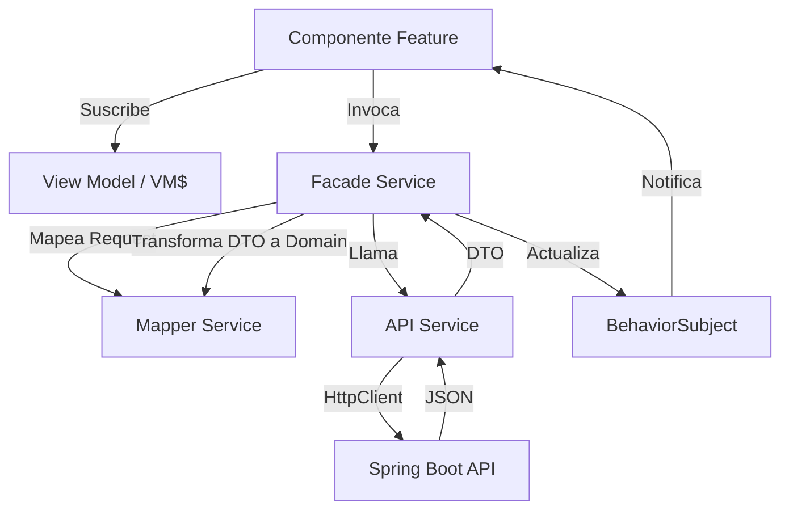

# Decisiones de Arquitectura Frontend — Thin Client & Selective Migration

Este documento detalla las decisiones arquitectónicas clave tomadas para el proyecto **ms-maestriacomputacion-front**, específicamente en relación con la migración de lógica y el manejo de lineamientos visuales.

## 1. Arquitectura de "Cliente Delgado" (Thin Client)

### Decisión
Se ha implementado una política de **Lógica Cero** en el frontend para todos los módulos financieros (**Matrícula Financiera** e **Información Presupuestaria**).

### Justificación Técnica
*   **Fuente Ášnica de Verdad (Single Source of Truth)**: Los cálculos financieros complejos (sumas, proyecciones, descuentos combinados) se realizan exclusivamente en el backend (servicios Java/Spring). Esto garantiza que no existan discrepancias entre los reportes visuales y los datos transaccionales.
*   **Aislamiento de Reglas de Negocio**: El frontend se desvincula de la volatilidad de las reglas fiscales o institucionales. Si cambia un porcentaje de beca, el cambio es transparente para la interfaz.
*   **Consistencia en Reportes y Exportaciones**: Al recibir los totales pre-calculados, el frontend asegura que los valores mostrados en pantalla coincidan exactamente con los reportes descargables (Excel/PDF).

### Implementación del Patrón "Lógica Cero"
En lugar de calcular el valor neto en el componente Angular, el frontend consume campos pre-procesados:
*   `totalNetoConDerechos`: Valor final listo para mostrar (incluye biblioteca, recursos y descuentos).
*   `valorMatricula`: Valor base bruto según el SMLV y semestres.
*   `totalDescuentos`: Suma agregada de beneficios aplicados.

**Ejemplo de flujo sin lógica local:**
Cuando un coordinador cambia un porcentaje de beca, el frontend no recalcula el total. En su lugar:
1.  Envía el nuevo porcentaje al backend vía `actualizarProyeccionEstudiante()`.
2.  El backend valida la regla (ej. 0-100%), aplica la fórmula financiera y persiste el cambio.
3.  El backend retorna el objeto completo del estudiante con los nuevos totales.
4.  El frontend simplemente actualiza el `BehaviorSubject`, y la UI se refresca vía `async pipe`.

---

## 2. Comunicación con Multi-Microservicios

El frontend orquesta la comunicación con dos microservicios distintos, manteniendo la transparencia para el usuario final.

### Configuración de Endpoints
Las URLs base se centralizan en `src/app/core/constants/api-url.ts`:
*   **Módulo Matrícula**: `http://localhost:8092/api/v1/gestion-matricula-financiera/`
*   **Módulo Presupuesto**: `http://localhost:8080/api/`

### Interoperabilidad
Aunque son servicios independientes, el frontend los unifica mediante:
*   **Token JWT Ášnico**: El `AuthInterceptor` adjunta el mismo token a todas las peticiones, permitiendo una experiencia SSO (Single Sign-On).
*   **DTOs Normalizados**: Las interfaces TypeScript (`estudiante.dto.ts`) aseguran que los datos de un servicio puedan ser entendidos o referenciados por el otro (ej. usando el código del estudiante como llave primaria).

---

## 3. Arquitectura Pattern B: Facade + Mappers + DTOs

Se ha adoptado una arquitectura basada en **Pattern B** (variante de Arquitectura Hexagonal) para desacoplar completamente la UI de la infraestructura de red.

### Flujo de Datos

### Definición de Capas

| Capa | Responsabilidad | Restricciones |
|------|----------------|---------------|
| **DTO (Data Transfer Object)** | Interfaces que espejan exactamente el JSON de la API. | No debe contener lógica ni métodos. |
| **Domain Models** | Entidades de negocio que la UI entiende. | Desacopladas de los nombres de campos de la base de datos. |
| **API Service** | Realiza llamadas HTTP puras usando `HttpClient`. | No procesa datos, solo retorna `Observable<DTO>`. |
| **Mapper Service** | Transforma DTOs en Modelos de Dominio y viceversa. | Funciones puras, sin efectos secundarios. |
| **Facade Service** | Orquestador. Gestiona el estado reactivo (`BehaviorSubject`), el `loading` y los `errors`. | Es la única puerta de entrada para los componentes. |

---

## 3. Estrategia de Ramas y Coexistencia Visual

El desarrollo del proyecto se ha estructurado en dos caminos paralelos para manejar la transición a los nuevos lineamientos de la Universidad del Cauca (TIC v3 2026).

### A. Rama `lineamientos-u` (Con Lineamientos)
*   **Enfoque**: Implementación total del Sistema de Diseño 2026.
*   **Estado Visual**: Uso estricto de colores institucionales, tipografía *Outfit*, y componentes compartidos con el prefijo `uni-`.
*   **Arquitectura**: Implementa Pattern B (Reactividad total).
*   **Destino**: Se mantiene como la rama de referencia para la versión "Premium Institucional" del sistema.

### B. Rama `sin-lineamientos-u` (Sin Lineamientos - Actual)
*   **Enfoque**: Mantener la estética visual de la versión original (`master`).
*   **Estado Visual**: Usa los estilos preexistentes de PrimeNG 13 y el CSS personalizado de los módulos originales.
*   **Arquitectura**: **Pattern B migrado**. Se ha extraído toda la lógica técnica de la rama `lineamientos-u` e integrado en esta rama.
*   **Justificación**: Permite que los módulos financieros tengan la misma robustez técnica y lógica que la versión institucional, pero sin romper la armonía visual con el resto de la aplicación (módulos legacy) que aún no han sido migrados al nuevo sistema de diseño.

---

## 4. Resumen de la "Migración Selectiva"

Para llegar al estado actual de esta rama, se realizó un proceso de extracción selectiva de archivos TypeScript (.ts):
1.  Se mantuvieron los **Templates HTML y SCSS** originales para preservar el diseño visual intacto.
2.  Se inyectaron las capas de datos (`data/`, `dto/`, `models/`) de `lineamientos-u`.
3.  Se adaptaron los componentes (`feature/`) para conectar el HTML antiguo con la nueva lógica reactiva (`vm$ | async`).

---

## 5. Matriz de Estado Actual (Qué tiene Lineamientos y Qué No)

Para evitar malentendidos, esta tabla resume el estado de cumplimiento en la rama actual (`sin-lineamientos-u`):

| Área | Estado | ¿Sigue Lineamientos? | Observación |
| :--- | :--- | :--- | :--- |
| **Lógica de Negocio** | Pattern B | **SÁ** | Se migró el 100% de la lógica técnica (Servicios, Facades, Mappers). |
| **Arquitectura de Datos** | Thin Client | **SÁ** | Delegación total al Backend (Lógica Cero en UI). |
| **Diseño Visual** | Legacy / Master | **NO** | Se preserva la estética original para mantener consistencia con el sistema base. |
| **Paleta de Colores** | PrimeNG Saga | **NO** | No se aplica el Azul Institucional #000066 en esta rama. |
| **Componentes UI** | PrimeNG Default | **NO** | Se usan componentes estándar (p-table, p-card) sin prefijo `uni-`. |

---

## 6. Comparativa Técnica de Estados Visuales

| Característica | Rama `lineamientos-u` | Rama `sin-lineamientos-u` (Actual) |
|----------------|-----------------------|------------------------------------|
| **Lógica de Negocio** | Pattern B (Reactiva) | Pattern B (Reactiva) |
| **Paleta de Colores** | Institucional 2026 | Legacy Master |
| **Componentes UI** | `uni-components` | PrimeNG 13 Standard |
| **Consistencia** | Con manual TIC v3 | Con el resto del sistema actual |

---

## 6. Mantenimiento y Evolución

Para futuros desarrollos en estos módulos, se deben seguir estas reglas:
1.  **No agregar cálculos en los componentes**: Si se necesita un valor sumado, solicitar al backend que lo incluya en el DTO.
2.  **Mantener el Facade como Ášnica Fuente**: Los componentes no deben inyectar el `ApiService` directamente.
3.  **Preservar la Reactividad**: Usar siempre el pipe `async` en los templates para manejar el ciclo de vida de los datos.

## 7. Referencias Técnicas (Kiro Specs)
Para auditoría del proceso de migración, consultar los reportes originales:
*   [Reporte de Migración](file:///d:/Daniel/Projects/practica-u/.kiro/specs/selective-logic-migration/migration-report.md): Lista detallada de archivos y conflictos resueltos.
*   [Diseño Técnico de Migración](file:///d:/Daniel/Projects/practica-u/.kiro/specs/selective-logic-migration/design.md): Especificación de las interfaces y mappers.
*   **Sistema de Diseño**: La documentación oficial de los lineamientos institucionales se encuentra en el directorio [`/sistema de diseño 2026/`](../../sistema%20de%20dise%C3%B1o%202026/).
