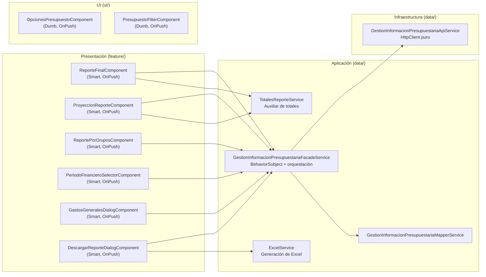
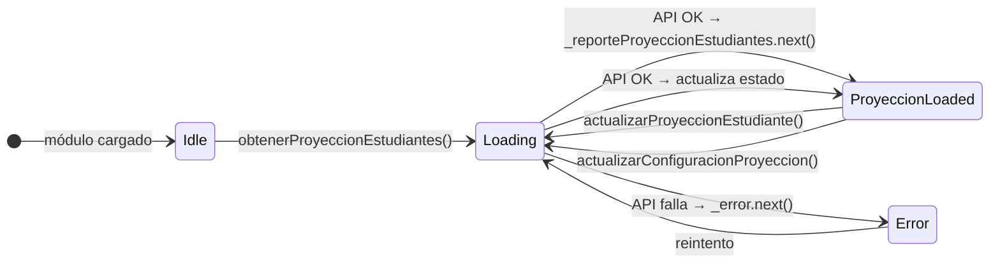

# Documentación Técnica — Módulo Gestión Información Presupuestaria

**Proyecto:** ms-maestriacomputacion-front
**Módulo:** `gestion-informacion-presupuestaria`
**Autor:** Daniel Felipe Contreras Tobar
**Fecha:** 2026-05-04
**Patrón arquitectónico:** Pattern B — Arquitectura Hexagonal (Thin Client)
**Stack:** Angular 13, TypeScript 4.4, PrimeNG 13, RxJS 7.4, ExcelJS
**Estado Visual:** Sin Lineamientos TIC (Consistencia con Master)

---

## 1. Descripción General

El módulo de **Gestión de Información Presupuestaria** permite al Coordinador de la Maestría en Computación gestionar y visualizar la información financiera del programa. Incluye tres vistas principales: proyección de ingresos del período activo, reporte financiero final de períodos cerrados, y distribución del presupuesto por grupos de investigación.

> [!IMPORTANT]
> Este módulo opera bajo la arquitectura de **"Lógica Cero"**. Todos los cálculos financieros son realizados por el backend. El frontend actúa únicamente como una capa de presentación y captura de datos. Para más detalles, ver [Decisiones de Arquitectura](../../management/frontend-architecture-decisions.md).

### Funcionalidades principales

| Funcionalidad | Rol | Descripción |
|--------------|-----|-------------|
| Proyección de reporte | ROLE_COORDINADOR | Editar y proyectar los ingresos del período académico activo |
| Reporte final | ROLE_COORDINADOR | Consultar el reporte financiero definitivo de períodos cerrados |
| Reporte por grupos | ROLE_COORDINADOR | Gestionar la distribución del presupuesto entre grupos de investigación |
| Gestión de gastos generales | ROLE_COORDINADOR | Crear, editar y eliminar gastos generales del período |
| Exportación a Excel | ROLE_COORDINADOR | Descargar reportes en formato Excel con múltiples hojas |
| Navegación por períodos | ROLE_COORDINADOR | Navegar entre períodos académicos con flechas anterior/siguiente |

---

## 2. Arquitectura del Módulo

### Estructura de carpetas

```
gestion-informacion-presupuestaria/
├── data/                                    ← Capa de datos
│   ├── api.service.ts                       ← Llamadas HTTP puras
│   ├── facade.service.ts                    ← Estado reactivo + orquestación
│   ├── mapper.service.ts                    ← Transformación DTO ↔ Dominio
│   ├── totales-reporte.service.ts           ← Servicio auxiliar de totales
│   └── excel.service.ts                     ← Generación de archivos Excel
├── dto/                                     ← Contratos con el backend
│   ├── api-error.ts
│   ├── configuracion-reporte-financiero.dto.ts
│   ├── configuracion-reporte-grupos.dto.ts
│   ├── gasto-general.dto.ts
│   ├── grupo.dto.ts
│   ├── items.dto.ts
│   ├── periodo-financiero.dto.ts
│   ├── porcentaje-grupo.dto.ts
│   ├── proyeccion-estudiante.dto.ts
│   ├── reporte-estudiantes.dto.ts
│   ├── reporte-por-grupos.dto.ts
│   ├── reporte-proyeccion-estudiantes.dto.ts
│   └── valor-grupo.dto.ts
├── feature/                                 ← Componentes de página (Smart)
│   ├── reporte-final/                       ← Reporte financiero final
│   ├── proyeccion-reporte/                  ← Proyección del período activo
│   ├── reporte-por-grupos/                  ← Distribución por grupos
│   ├── periodo-financiero-selector/         ← Selector de período con flechas
│   ├── gastos-generales-dialog/             ← Modal de gestión de gastos
│   └── descargar-reporte-dialog/            ← Modal de descarga Excel
├── models/
│   ├── domain-models.ts                     ← Entidades del dominio
│   └── reporte-final.vm.ts                  ← View Model del reporte final
├── ui/                                      ← Componentes presentacionales (Dumb)
│   ├── opciones-presupuesto/                ← Tabs de navegación entre reportes
│   ├── presupuesto-filter/                  ← Filtro reactivo con debounce
│   └── presupuesto-form/                    ← Formulario de partidas (scaffold)
├── gestion-informacion-presupuestaria-routing.module.ts
└── gestion-informacion-presupuestaria.module.ts
```

### Diagrama de arquitectura



---

## 3. Entidades del Dominio

### `PeriodoFinanciero`
| Campo | Tipo | Descripción |
|-------|------|-------------|
| `periodo` | `number` | Número del período (1 o 2) |
| `año` | `number` | Año del período |

### `ConfiguracionReporteFinanciero`
Configuración financiera del período. Define los valores base para los cálculos.

| Campo | Tipo | Descripción |
|-------|------|-------------|
| `id` | `number` | ID de la configuración |
| `esReporteFinal` | `boolean` | Si es reporte final (vs. proyección) |
| `biblioteca` | `number` | Valor de derechos de biblioteca (COP) |
| `recursosComputacionales` | `number` | Valor de recursos computacionales (COP) |
| `valorSMLV` | `number` | Valor del SMLV vigente (COP) |
| `porcentajeVotacionFijo` | `number` | Porcentaje de descuento por votación (0-1) |
| `porcentajeEgresadoFijo` | `number` | Porcentaje de descuento por egresado (0-1) |
| `objPeriodoFinanciero` | `PeriodoFinanciero` | Período al que pertenece |

### `ProyeccionEstudiante`
Estudiante con sus valores financieros calculados por el backend.

| Campo | Tipo | Descripción |
|-------|------|-------------|
| `codigoEstudiante` | `string` | Código del estudiante |
| `nombre` / `apellido` | `string` | Nombre completo |
| `identificacion` | `number` | Número de cédula |
| `estaPago` | `boolean` | Estado de pago |
| `aplicaVotacion` | `boolean` | Si aplica descuento por votación |
| `porcentajeBeca` | `number` | Porcentaje de beca (0-1) |
| `aplicaEgresado` | `boolean` | Si aplica descuento de egresado |
| `grupoInvestigacion` | `string` | Grupo de investigación al que pertenece |
| `valorMatricula` | `number?` | Valor bruto de matrícula (calculado backend) |
| `valorDescuentoVoto` | `number?` | Descuento por votación (calculado backend) |
| `valorDescuentoBeca` | `number?` | Descuento por beca (calculado backend) |
| `valorDescuentoEgresado` | `number?` | Descuento por egresado (calculado backend) |
| `totalDescuentos` | `number?` | Suma de todos los descuentos |
| `valorNeto` | `number?` | Valor neto sin derechos |
| `totalNetoConDerechos` | `number?` | Valor final con biblioteca y recursos |

### `ReporteProyeccionEstudiantes`
Respuesta completa del endpoint de proyección.

| Campo | Tipo | Descripción |
|-------|------|-------------|
| `estudiantes` | `ProyeccionEstudiante[]` | Lista de estudiantes con valores calculados |
| `objConfiguracion` | `ConfiguracionReporteFinanciero` | Configuración del período |
| `periodo` | `PeriodoFinanciero` | Período de la proyección |
| `totalNeto` | `number?` | Total neto del período |
| `totalDescuentos` | `number?` | Total de descuentos |
| `totalIngresos` | `number?` | Total de ingresos netos |

### `ReportePorGrupos`
Distribución del presupuesto entre grupos de investigación.

| Campo | Tipo | Descripción |
|-------|------|-------------|
| `filasPorGrupo` | `ReportePorGrupoFila[]` | Una fila por grupo de investigación |
| `gastosGenerales` | `GastoGeneral[]` | Gastos generales del período |
| `objConfiguracionReporteGrupos` | `ConfiguracionReporteGrupos` | Configuración de distribución |
| `esEditable` | `boolean?` | Si el período permite edición |
| `totalNeto` | `number` | Total neto a distribuir |

### `GastoGeneral`
| Campo | Tipo | Descripción |
|-------|------|-------------|
| `idGastoGeneral` | `number` | ID del gasto |
| `categoria` | `string` | Categoría del gasto |
| `descripcion` | `string` | Descripción detallada |
| `monto` | `number` | Monto en COP |

### `ReporteFinalVM` (View Model)
View Model de presentación para el reporte final. Encapsula los cálculos de visualización separándolos del componente.

```typescript
// Creado con la función factory mapToReporteFinalVM(estudiante, configuracion)
interface ReporteFinalVM extends ProyeccionEstudiante {
  nombreEstudiante: string;   // nombre + apellido concatenados
  matricula: number;           // valorMatricula del backend
  valorBeca: number;           // valorDescuentoBeca del backend
  valorEgresado: number;       // valorDescuentoEgresado del backend
  recursosComputacionales: number; // de la configuración
  biblioteca: number;          // de la configuración
  grupoDescuentos: number;     // totalDescuentos del backend
  totalNeto: number;           // totalNetoConDerechos del backend
}
```

---

## 4. Capa de Datos

### `GestionInformacionPresupuestariaApiService`
Servicio de infraestructura. Solo llamadas `HttpClient` directas. Sin lógica de encadenamiento.

| Método | HTTP | Endpoint | Descripción |
|--------|------|----------|-------------|
| `obtenerPeriodos()` | GET | `/info-presupuestaria/periodos` | Todos los períodos |
| `obtenerPeriodosActivos()` | GET | `/info-presupuestaria/periodos/activos` | Solo períodos activos |
| `obtenerPeriodosInactivos()` | GET | `/info-presupuestaria/periodos/cerrados` | Solo períodos cerrados |
| `obtenerPeriodosActivosYCerrados()` | GET | `/info-presupuestaria/periodos/activos-y-cerrados` | Activos y cerrados |
| `obtenerPeriodoProyeccion()` | GET | `/info-presupuestaria/periodos/proyeccion` | Período de proyección activo |
| `obtenerProyeccionEstudiantes(tagPeriodo?, anio?)` | GET | `/info-presupuestaria/proyeccion-estudiantes` | Proyección del período |
| `actualizarProyeccionEstudiante(dto, tagPeriodo?, anio?)` | PUT | `/info-presupuestaria/proyeccion-estudiantes` | Actualiza datos de un estudiante |
| `obtenerReporteFinanciero(tagPeriodo, anio)` | GET | `/info-presupuestaria/reporte-financiero` | Reporte final del período |
| `obtenerIdConfiguracionReporteFinanciero(tagPeriodo, anio)` | GET | `/info-presupuestaria/configuracion-reporte-financiero/periodo` | ID de la configuración |
| `actualizarConfiguracionReporteFinanciero(id, config)` | PUT | `/info-presupuestaria/configuracion-reporte-financiero/{id}` | Actualiza configuración |
| `obtenerReportePorGrupos(anio)` | GET | `/info-presupuestaria/reporte-por-grupos` | Reporte por grupos del año |
| `actualizarParticipacionGrupo(dto)` | PUT | `/info-presupuestaria/reporte-por-grupos/participacion` | Actualiza % de participación |
| `actualizarPorcentajeAUI(periodoId, porcentaje)` | PUT | `/info-presupuestaria/reporte-por-grupos/aui` | Actualiza % AUI Universidad |
| `actualizarExcedentesMaestria(periodoId, valor)` | PUT | `/info-presupuestaria/reporte-por-grupos/excedentes` | Actualiza excedentes |
| `actualizarVigenciasAnterioresGrupo(periodoId, grupoId, valor)` | PUT | `/info-presupuestaria/reporte-por-grupos/vigencias` | Actualiza vigencias anteriores |
| `actualizarItems(periodoId, item1, item2)` | PUT | `/info-presupuestaria/reporte-por-grupos/items` | Actualiza porcentajes de ítems |
| `actualizarImprevistos(periodoId, porcentaje)` | PUT | `/info-presupuestaria/reporte-por-grupos/imprevistos` | Actualiza % imprevistos |
| `crearGastoGeneral(periodoId, dto)` | POST | `/info-presupuestaria/reporte-por-grupos/gastos` | Crea gasto general |
| `actualizarGastoGeneral(id, periodoId, dto)` | PUT | `/info-presupuestaria/reporte-por-grupos/gastos/{id}` | Actualiza gasto general |
| `eliminarGastoGeneral(id, periodoId)` | DELETE | `/info-presupuestaria/reporte-por-grupos/gastos/{id}` | Elimina gasto general |

### `GestionInformacionPresupuestariaFacadeService`
Servicio de aplicación. Gestiona el estado reactivo y orquesta los casos de uso.

**Estado expuesto:**

| Observable | Tipo | Descripción |
|-----------|------|-------------|
| `loading$` | `Observable<boolean>` | Indicador de carga activa |
| `error$` | `Observable<ApiError \| null>` | Error de la última operación |
| `reporteProyeccionEstudiantes$` | `Observable<ReporteProyeccionEstudiantes \| null>` | Reporte de proyección actual |
| `reporteGrupos$` | `Observable<ReportePorGrupos \| null>` | Reporte por grupos actual |

**Métodos principales:**

| Método | Descripción |
|--------|-------------|
| `obtenerPeriodosFinancieros()` | Carga todos los períodos |
| `obtenerPeriodosActivos()` | Carga períodos activos |
| `obtenerPeriodosCerrados()` | Carga períodos cerrados |
| `obtenerPeriodosActivosYCerrados()` | Carga activos y cerrados |
| `obtenerPeriodoProyeccion()` | Carga el período de proyección |
| `obtenerProyeccionEstudiantes(tagPeriodo?, anio?)` | Carga proyección y actualiza `reporteProyeccionEstudiantes$` |
| `actualizarProyeccionEstudiante(proyeccion, tagPeriodo?, anio?)` | Actualiza datos de un estudiante en la proyección |
| `obtenerReporteFinanciero(tagPeriodo, anio)` | Carga el reporte final |
| `actualizarConfiguracionProyeccion(config)` | Actualiza configuración del período activo (encadena 3 llamadas via `switchMap`) |
| `actualizarConfiguracionReporteFinanciero(config, tagPeriodo, anio)` | Actualiza configuración de un período específico |
| `obtenerReporteGrupos(anio)` | Carga reporte por grupos y actualiza `reporteGrupos$` |
| `actualizarParticipacionGrupo(dto)` | Actualiza % de participación de un grupo |
| `actualizarPorcentajeAUIUniversidad(periodoId, porcentaje)` | Actualiza % AUI |
| `actualizarValorExcedentesMaestria(periodoId, valor)` | Actualiza excedentes |
| `crearGastoGeneral(periodoId, gasto)` | Crea un gasto general |
| `actualizarGastoGeneral(...)` | Actualiza un gasto (sobrecargado: acepta objeto o parámetros separados) |
| `eliminarGastoGeneral(id, periodoId)` | Elimina un gasto general |
| `actualizarPorcentajeItems(items, periodoId)` | Actualiza porcentajes de ítems |
| `actualizarPorcentajeImprevistos(periodoId, valor)` | Actualiza % imprevistos |
| `actualizarVigenciasAnterioresGrupo(periodoId, grupoId, valor)` | Actualiza vigencias anteriores |

### `TotalesReporteService`
Servicio auxiliar que normaliza los totales recibidos del backend, convirtiendo `null`/`undefined` a `0`.

```typescript
fromBackend({ totalNeto?, totalDescuentos?, totalIngresos? }): TotalesReporte
```

### `ExcelService`
Servicio de generación de archivos Excel usando la librería `ExcelJS`. Genera workbooks con múltiples hojas con formato profesional.

| Método | Descripción | Hojas generadas |
|--------|-------------|-----------------|
| `generarExcelReporteFinal(data)` | Reporte final en Excel | Resumen Ejecutivo, Estudiantes, Análisis Descuentos, Datos para Gráficas |
| `generarExcelProyeccionReporte(data)` | Proyección en Excel | Resumen Ejecutivo, Proyección Estudiantes, Análisis Descuentos |
| `generarExcelReportePorGrupos(data)` | Reporte por grupos en Excel | Resumen General, Distribución Financiera, Gastos Generales, Átems y Presupuesto, una hoja por grupo |

---

## 5. Componentes

### `ReporteFinalComponent` (Smart)
**Ruta:** `/informacion-presupuestaria/reporte-final`
**Rol requerido:** `ROLE_COORDINADOR`

Muestra el reporte financiero definitivo de períodos académicos cerrados.

**Funcionalidades:**
- Selector de período con modo `'cerrados'` (solo períodos finalizados)
- Tabla de estudiantes con valores calculados por el backend
- Panel de configuración (biblioteca, recursos computacionales, SMLV) — solo lectura
- Totales: bruto, descuentos, ingresos netos
- Botón de descarga (delega a `DescargarReporteDialogComponent`)

**View Model:** Usa `mapToReporteFinalVM()` para transformar `ProyeccionEstudiante` en `ReporteFinalVM` antes de renderizar.

---

### `ProyeccionReporteComponent` (Smart)
**Ruta:** `/informacion-presupuestaria/proyeccion-reporte`
**Rol requerido:** `ROLE_COORDINADOR`

Permite editar la proyección de ingresos del período académico activo.

**Funcionalidades:**
- Selector de período con modo `'activos'`
- Tabla editable de estudiantes (edición inline por fila con PrimeNG `editMode="row"`)
- Edición de configuración de cabecera (biblioteca, recursos, SMLV)
- Validación de porcentaje de beca (0-100%)
- Control de edición concurrente: no permite editar cabecera y fila simultáneamente
- Restauración de valores al cancelar edición
- Totales actualizados en tiempo real tras cada guardado

**Flujo de edición de fila:**
```
onRowEditInit() → clona la fila en clonedEstudiantes
onRowEditSave() → valida porcentaje → Facade.actualizarProyeccionEstudiante()
                                    → procesarRespuesta() → actualiza tabla
onRowEditCancel() → restaura desde clonedEstudiantes
```

---

### `ReportePorGruposComponent` (Smart)
**Ruta:** `/informacion-presupuestaria/reporte-por-grupos`
**Rol requerido:** `ROLE_COORDINADOR`

El componente más complejo del módulo. Gestiona la distribución del presupuesto entre grupos de investigación.

**Funcionalidades:**
- Selector de período con modo `'anios-activos-y-cerrados'` (por año, no por semestre)
- Gráfico de barras de participación por grupo (PrimeNG Chart)
- Tabla de participación y aportes por grupo (editable si `esEditable = true`)
- Tabla de distribución de ingresos y gastos
- Tabla de asignación por ítems
- Tabla de imprevistos y montos finales
- Modal de gastos generales (CRUD completo)
- Control de edición concurrente con `isAnyEditActive`
- Normalización de porcentajes para display (ratio 0-1 → porcentaje 0-100)

**Secciones de la pantalla:**
1. Participación y Aporte por Grupo
2. Distribución de Ingresos y Gastos (AUI, Excedentes, Gastos Generales)
3. Asignación por Átems (Átem 1, Átem 2)
4. Imprevistos y Montos Finales (Vigencias Anteriores)

---

### `PeriodoFinancieroSelectorComponent` (Smart)
**Selector:** `app-periodo-financiero-selector`

Componente reutilizable de selección de período con navegación por flechas.

**Inputs:**
| Input | Tipo | Descripción |
|-------|------|-------------|
| `modo` | `PeriodoSelectorModo` | `'todos'`, `'activos'`, `'cerrados'`, `'activos-y-cerrados'`, `'anios-activos-y-cerrados'` |
| `mensajeVacio` | `string` | Mensaje cuando no hay períodos |

**Outputs:**
| Output | Tipo | Descripción |
|--------|------|-------------|
| `periodoSeleccionado` | `EventEmitter<PeriodoFinancieroDTORespuesta>` | Emite cuando cambia el período |
| `esUltimoPeriodoChange` | `EventEmitter<boolean>` | Si es el último período disponible |
| `sinPeriodosChange` | `EventEmitter<boolean>` | Si no hay períodos disponibles |
| `errorCargaChange` | `EventEmitter<boolean>` | Si hubo error al cargar |

**Modo `'anios-activos-y-cerrados'`:** Deduplica por año, mostrando solo un período por año.

---

### `GastosGeneralesDialogComponent` (Smart)
**Selector:** `app-gastos-generales-dialog`

Modal para gestión CRUD de gastos generales del período.

**Funcionalidades:**
- Listado de gastos con edición inline
- Agregar nuevo gasto con validación (categoría, descripción, monto > 0)
- Editar gasto existente con restauración al cancelar
- Eliminar gasto con confirmación via `ConfirmationService`
- Emite `onCambio` para que el padre actualice su estado

---

### `DescargarReporteDialogComponent` (Smart)
**Selector:** `app-descargar-reporte-dialog`

Modal para seleccionar y descargar reportes en Excel.

**Funcionalidades:**
- Selección de tipo de reporte (Final, Proyección, Por Grupos)
- Selección de período (filtrado según el tipo de reporte)
- Descarga via `ExcelService`
- Sincronización automática con el período activo en la pantalla

---

### `OpcionesPresupuestoComponent` (Dumb)
**Selector:** `app-opciones-presupuesto`

Barra de navegación entre las tres vistas del módulo con botón de descarga.

**Inputs:** `activeTab: string`, `currentPeriod: PeriodoFinancieroDTORespuesta | null`
**Outputs:** `onDescargar: EventEmitter<void>`

---

## 6. Rutas del Módulo

| Ruta | Componente | Guard | Rol |
|------|-----------|-------|-----|
| `` (vacío) | Redirige a `reporte-final` | — | — |
| `reporte-final` | `ReporteFinalComponent` | `RoleGuard` | `ROLE_COORDINADOR` |
| `proyeccion-reporte` | `ProyeccionReporteComponent` | `RoleGuard` | `ROLE_COORDINADOR` |
| `reporte-por-grupos` | `ReportePorGruposComponent` | `RoleGuard` | `ROLE_COORDINADOR` |

El módulo se carga con **lazy loading** desde `app-routing.module.ts`.

---

## 7. Flujo de Estado Reactivo



---

## 8. Decisiones de Diseño

### Normalización de porcentajes para display
El backend almacena porcentajes como ratios (0-1), pero la UI los muestra como porcentajes (0-100). El componente `ReportePorGruposComponent` normaliza los valores al recibirlos con `normalizarPorcentajesParaDisplay()` y los convierte de vuelta a ratio al enviarlos con `toRatio()`.

### Separación de lógica de encadenamiento en el Facade
El método `actualizarConfiguracionProyeccion()` requiere primero obtener el período de proyección, luego obtener el ID de la configuración, y finalmente actualizar. Esta lógica de encadenamiento vive en el Facade (via `switchMap`), no en el ApiService. El ApiService solo tiene métodos HTTP simples.

### View Model para el Reporte Final
El `ReporteFinalVM` y su función factory `mapToReporteFinalVM()` siguen el principio de Responsabilidad Ášnica (SRP): el componente solo renderiza, el View Model calcula. Esto facilita el testing unitario de la lógica de presentación.

### Control de edición concurrente
El flag `isAnyEditActive` previene que el usuario edite múltiples secciones simultáneamente, evitando condiciones de carrera en las peticiones al backend.

### ExcelService con múltiples hojas
El servicio de Excel genera workbooks con formato profesional (colores, bordes, filas alternas, totales resaltados) usando `ExcelJS`. Cada tipo de reporte tiene su propio conjunto de hojas optimizado para el análisis financiero.

---

## 9. Tests Unitarios

| Archivo | Tests | Cobertura |
|---------|-------|-----------|
| `data/facade.service.spec.ts` | 16 | ~90% |
| `data/mapper.service.spec.ts` | 11 | ~95% |
| **Total** | **27** | **~92%** |

Ver detalle completo en `docs/testing/TestCoverage_Report.md`.
