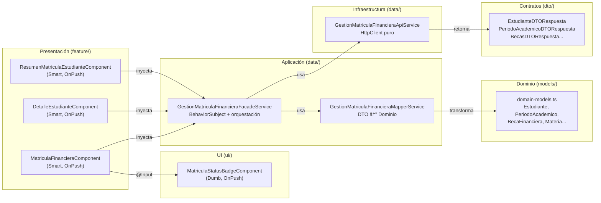
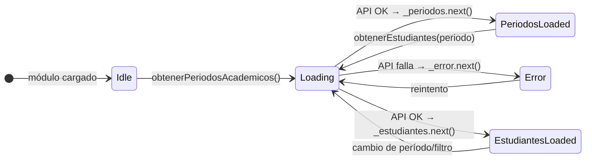

# Documentación Técnica — Módulo Gestión Matrícula Financiera

**Proyecto:** ms-maestriacomputacion-front
**Módulo:** `gestion-matricula-financiera`
**Autor:** Daniel Felipe Contreras Tobar
**Fecha:** 2026-05-04
**Patrón arquitectónico:** Pattern B — Arquitectura Hexagonal (Thin Client)
**Stack:** Angular 13, TypeScript 4.4, PrimeNG 13, RxJS 7.4
**Estado Visual:** Sin Lineamientos TIC (Consistencia con Master)

---

## 1. Descripción General

El módulo de **Gestión de Matrícula Financiera** permite al Coordinador de la Maestría en Computación consultar y gestionar el estado financiero de los estudiantes matriculados. Adicionalmente, permite a los estudiantes consultar el resumen de su propia matrícula financiera.

> [!IMPORTANT]
> Este módulo opera bajo la arquitectura de **"Lógica Cero"**. Todos los cálculos financieros son realizados por el backend. El frontend actúa únicamente como una capa de presentación y captura de datos. Para más detalles, ver [Decisiones de Arquitectura](../../management/frontend-architecture-decisions.md).

### Funcionalidades principales

| Funcionalidad | Rol | Descripción |
|--------------|-----|-------------|
| Listado de estudiantes | ROLE_COORDINADOR | Visualizar todos los estudiantes del período seleccionado con su estado de pago |
| Filtrado por período y semestre | ROLE_COORDINADOR | Filtrar la lista por período académico y semestre financiero |
| Detalle de estudiante | ROLE_COORDINADOR | Ver información completa de matrícula, becas, descuentos y materias de un estudiante |
| Resumen de matrícula | ROLE_ESTUDIANTE | Consultar el estado y detalle de la propia matrícula financiera |
| Solicitar revisión | ROLE_ESTUDIANTE | Iniciar una solicitud de revisión de matrícula desde el resumen |

---

## 2. Arquitectura del Módulo

### Estructura de carpetas

```
gestion-matricula-financiera/
├── data/                          ← Capa de datos (Application + Infrastructure)
│   ├── api.service.ts             ← Llamadas HTTP puras al backend
│   ├── facade.service.ts          ← Estado reactivo + orquestación de casos de uso
│   └── mapper.service.ts          ← Transformación DTO ↔ Dominio
├── dto/                           ← Contratos con el backend (request/response)
│   ├── api-error.ts
│   ├── beca-financiera.dto.ts
│   ├── descuento-financiero.dto.ts
│   ├── docente.dto.ts
│   ├── estudiante.dto.ts
│   ├── materia.dto.ts
│   ├── matricula-academica.dto.ts
│   ├── matricula-financiera.dto.ts
│   └── periodo-academico.dto.ts
├── feature/                       ← Componentes de página (Smart)
│   ├── matricula-financiera/      ← Listado principal (ROLE_COORDINADOR)
│   ├── detalle-estudiante/        ← Detalle de un estudiante (ROLE_COORDINADOR)
│   └── resumen-matricula-estudiante/ ← Vista del estudiante (ROLE_ESTUDIANTE)
├── models/
│   └── domain-models.ts           ← Entidades del dominio (TypeScript puro)
├── ui/                            ← Componentes presentacionales (Dumb)
│   └── matricula-status-badge/    ← Badge de estado de matrícula
├── gestion-matricula-financiera-routing.module.ts
└── gestion-matricula-financiera.module.ts
```

### Diagrama de arquitectura hexagonal



---

## 3. Entidades del Dominio

### `EstadoMatricula` (tipo)
```typescript
type EstadoMatricula = 'PENDIENTE' | 'AL_DIA' | 'MORA' | 'EXONERADO' | 'BECADO' | 'ANULADO';
```

### `Estudiante`
Entidad principal del módulo. Representa un estudiante con toda su información financiera.

| Campo | Tipo | Descripción |
|-------|------|-------------|
| `codigo` | `string` | Código único del estudiante |
| `nombre` | `string` | Nombre del estudiante |
| `apellido` | `string` | Apellido del estudiante |
| `identificacion` | `number` | Número de cédula |
| `cohorte` | `string` | Año de ingreso a la maestría |
| `periodoIngreso` | `string` | Período de ingreso (ej. "2020-1") |
| `semestreFinanciero` | `number` | Semestre financiero actual |
| `semestreAcademico` | `number?` | Semestre académico actual |
| `valorEnSMLV` | `number \| null` | Valor de matrícula en SMLV |
| `esEgresadoUnicauca` | `boolean?` | Si aplica descuento de egresado |
| `aplicaVotacion` | `boolean?` | Si aplica descuento por votación |
| `matriculasFinancieras` | `MatriculaFinanciera[]` | Historial de matrículas financieras |
| `descuentos` | `DescuentoFinanciero[]` | Descuentos aplicados |
| `becas` | `BecaFinanciera[]` | Becas asignadas |
| `becasDescuentos` | `BecaFinanciera[]` | Becas con descuento combinado |
| `materias` | `Materia[]` | Materias matriculadas |
| `estaPago` | `boolean?` | Estado de pago (`true`=pagado, `false`=pendiente, `null`=indeterminado) |

### `PeriodoAcademico`
| Campo | Tipo | Descripción |
|-------|------|-------------|
| `id` | `number?` | ID del período |
| `tagPeriodo` | `number?` | Número del período (1 o 2) |
| `año` | `number?` | Año del período |
| `fechaInicio` | `string?` | Fecha de inicio (ISO) |
| `fechaFin` | `string?` | Fecha de fin (ISO) |
| `fechaFinMatricula` | `string?` | Fecha límite de matrícula (ISO) |
| `estado` | `string?` | Estado del período |

### `BecaFinanciera`
| Campo | Tipo | Descripción |
|-------|------|-------------|
| `resolucion` | `string` | Número de resolución |
| `porcentaje` | `number` | Porcentaje de descuento (0-100) |
| `tipo` | `string` | Tipo de beca |
| `estado` | `string` | Estado de la beca |
| `avaladoConcejo` | `string \| null` | Si está avalada por el concejo |

---

## 4. Capa de Datos

### `GestionMatriculaFinancieraApiService`
Servicio de infraestructura. Solo contiene llamadas `HttpClient`. Sin estado, sin lógica de negocio.

| Método | HTTP | Endpoint | Descripción |
|--------|------|----------|-------------|
| `obtenerEstudiantes(periodo)` | POST | `/gestion-matricula-financiera/estudiantes` | Lista estudiantes del período |
| `obtenerEstudiante(codigo, tagPeriodo?, anio?)` | GET | `/gestion-matricula-financiera/estudiantes/{codigo}` | Detalle de un estudiante |
| `obtenerPeriodosAcademicos()` | GET | `/gestion-matricula-financiera/periodos` | Lista de períodos disponibles |
| `iniciarNuevaMatriculaFinanciera()` | POST | `/gestion-matricula-financiera/iniciar` | Inicia nuevo proceso de matrícula |
| `tieneDescuentoVoto(codigo)` | GET | `/gestion-matricula-financiera/estudiantes/{codigo}/descuento-voto` | Verifica descuento por voto |

### `GestionMatriculaFinancieraFacadeService`
Servicio de aplicación. Gestiona el estado reactivo del módulo y orquesta los casos de uso.

**Estado expuesto (BehaviorSubject → Observable):**

| Observable | Tipo | Descripción |
|-----------|------|-------------|
| `loading$` | `Observable<boolean>` | Indicador de carga activa |
| `error$` | `Observable<ApiError \| null>` | Error de la última operación |
| `estudiantes$` | `Observable<Estudiante[]>` | Lista de estudiantes cargados |
| `estudianteSeleccionado$` | `Observable<Estudiante \| null>` | Estudiante en detalle |
| `periodos$` | `Observable<PeriodoAcademico[]>` | Períodos académicos disponibles |
| `periodoSeleccionadoFiltro$` | `Observable<PeriodoAcademico \| null>` | Período activo en el filtro |
| `semestreSeleccionadoFiltro$` | `Observable<number \| null>` | Semestre activo en el filtro |

**Métodos:**

| Método | Retorno | Descripción |
|--------|---------|-------------|
| `obtenerEstudiantes(periodo)` | `Observable<Estudiante[]>` | Carga lista de estudiantes |
| `obtenerEstudiante(codigo)` | `Observable<Estudiante>` | Carga detalle de un estudiante |
| `obtenerPeriodosAcademicos()` | `Observable<PeriodoAcademico[]>` | Carga períodos disponibles |
| `iniciarNuevaMatriculaFinanciera()` | `Observable<boolean>` | Inicia nuevo proceso |
| `setPeriodoFiltro(periodo)` | `void` | Guarda el período seleccionado |
| `getPeriodoFiltro()` | `PeriodoAcademico \| null` | Obtiene el período guardado |
| `setSemestreFiltro(semestre)` | `void` | Guarda el semestre seleccionado |
| `getSemestreFiltro()` | `number \| null` | Obtiene el semestre guardado |

### `GestionMatriculaFinancieraMapperService`
Servicio de transformación. Convierte DTOs del backend a entidades del dominio y viceversa.

| Método | Descripción |
|--------|-------------|
| `mappearDeRespuestaAPeriodoAcademico(dto)` | DTO → PeriodoAcademico. Deriva `año` de `fechaInicio` si `anio` es null |
| `mappearDePeriodoAcademicoAPeticion(domain)` | PeriodoAcademico → DTO de petición |
| `mappearDeRespuestaAEstudiante(dto)` | DTO → Estudiante. Maneja colecciones nulas con `[]` |
| `mappearDeListaRespuestaAEstudiante(dtos)` | Lista DTO → Lista Estudiante |
| `mappearDeListaRespuestaAPeriodoAcademico(dtos)` | Lista DTO → Lista PeriodoAcademico |
| `mappearDeRespuestaABecaFinanciera(dto)` | DTO → BecaFinanciera. Aplica defaults para campos nulos |
| `mappearDeRespuestaAMateria(dto)` | DTO → Materia |
| `mappearDeRespuestaADocente(dto)` | DTO → Docente |

---

## 5. Componentes

### `MatriculaFinancieraComponent` (Smart)
**Ruta:** `/gestion-matricula-financiera`
**Rol requerido:** `ROLE_COORDINADOR`

Pantalla principal del módulo. Muestra la lista de estudiantes matriculados con filtros por período académico y semestre financiero.

**Funcionalidades:**
- Carga automática de períodos al inicializar
- Restaura el período y semestre previamente seleccionados desde el Facade
- Filtrado local por semestre financiero
- Búsqueda global en la tabla (código, nombre, apellido, cohorte, período de ingreso)
- Paginación (10, 25, 50 registros por página)
- Navegación al detalle del estudiante

**Flujo de datos reactivo:**
```
ngOnInit → vm$ = combineLatest({
                estudiantes$, periodos$, 
                periodoSeleccionado$, semestreSeleccionado$
             }).pipe(
                map(...) → filtra estudiantes y construye dropdowns reactivamente
             )
```

**Métodos de filtrado:**
- `filtrarEstudiantes()`: Aplica el filtro de semestre sobre la lista base.
- `obtenerOpcionesSemestre()`: Extrae dinámicamente los semestres disponibles en los datos.
- `obtenerEtiquetaPeriodo()`: Construye el label descriptivo para los períodos.

---

### `DetalleEstudianteComponent` (Smart)
**Ruta:** `/gestion-matricula-financiera/detalle/:id`
**Rol requerido:** `ROLE_COORDINADOR`

Muestra la información completa de matrícula de un estudiante específico.

**Funcionalidades:**
- Lee el código del estudiante desde los parámetros de la ruta
- Valida que el ID no sea vacío o solo espacios
- Carga el detalle via `Facade.obtenerEstudiante(codigo)`
- Usa el componente compartido `TablaMatriculaEstudianteComponent` para mostrar los datos
- Botón "Volver" que navega a la lista principal

---

### `ResumenMatriculaEstudianteComponent` (Smart)
**Ruta:** `/gestion-matricula-financiera/resumen` y `/gestion-matricula-financiera/resumen/:id`
**Rol requerido:** `ROLE_ESTUDIANTE`

Vista del estudiante para consultar su propia matrícula financiera. Fue actualizado con mejoras significativas de UX.

**Funcionalidades actuales:**
- Carga primero los períodos académicos para mostrar el período activo en el header
- Si hay `:id` en la ruta, lo usa como código del estudiante
- Si no hay `:id`, obtiene el código del usuario autenticado via `AutenticacionService`
- Muestra el período académico activo como badge en el header (`getPeriodoLabel()`)
- Usa el componente compartido `TablaMatriculaEstudianteComponent` para mostrar los datos
- Si el estudiante no tiene matrícula o hay un error 404, muestra un estado vacío informativo en lugar de redirigir
- El botón "Solicitar Revisión" es **siempre visible** — tanto si hay datos como si no — para que el estudiante pueda solicitar revisión en cualquier caso
- Navega al módulo de solicitudes con el tipo `RE_MATR` preseleccionado

**Flujo de carga actualizado:**
```
ngOnInit → cargarDatosIniciales()
         → obtenerPeriodosAcademicos() → periodoActual = periodos[0]
                                       → setPeriodoFiltro(periodoActual)
         → route.paramMap → obtener id (ruta o usuario autenticado)
         → cargarEstudiante(id) → obtenerEstudiante(id)
                                → si 404: muestra estado vacío + botón revisión
                                → si ok: muestra TablaMatriculaEstudianteComponent
```

**Propiedades del componente:**
| Propiedad | Tipo | Descripción |
|-----------|------|-------------|
| `estudiante` | `Estudiante \| null` | Datos del estudiante cargado |
| `periodoActual` | `PeriodoAcademico \| null` | Período académico activo mostrado en el header |

**Métodos:**
| Método | Descripción |
|--------|-------------|
| `cargarDatosIniciales()` | Carga períodos y luego el estudiante en secuencia |
| `cargarEstudiante(id)` | Carga el detalle del estudiante; en error muestra estado vacío sin redirigir |
| `solicitarRevision()` | Preselecciona `RE_MATR` y navega al módulo de solicitudes |
| `getPeriodoLabel()` | Construye el label del período (`{año}-{periodo}`) compatible con ASCII |

---

### `MatriculaStatusBadgeComponent` (Dumb)
**Selector:** `app-matricula-status-badge`
**ChangeDetection:** `OnPush`

Componente presentacional que muestra un badge visual con el estado de matrícula.

**Inputs:**
| Input | Tipo | Descripción |
|-------|------|-------------|
| `estado` | `EstadoMatricula` | Estado a mostrar |
| `mostrarIcono` | `boolean` | Si mostrar el ícono emoji (default: `true`) |

**Mapeo de estados a íconos:**
| Estado | Ácono |
|--------|-------|
| PENDIENTE | ⏳ |
| AL_DIA | ✅ |
| MORA | ⚠️ |
| EXONERADO | 🎓 |
| BECADO | 🏅 |
| ANULADO | ❌ |

---

## 6. Rutas del Módulo

| Ruta | Componente | Guard | Rol |
|------|-----------|-------|-----|
| `` (vacío) | `MatriculaFinancieraComponent` | `RoleGuard` | `ROLE_COORDINADOR` |
| `detalle/:id` | `DetalleEstudianteComponent` | `RoleGuard` | `ROLE_COORDINADOR` |
| `resumen` | `ResumenMatriculaEstudianteComponent` | `RoleGuard` | `ROLE_ESTUDIANTE` |
| `resumen/:id` | `ResumenMatriculaEstudianteComponent` | `RoleGuard` | `ROLE_ESTUDIANTE` |

El módulo se carga con **lazy loading** desde `app-routing.module.ts`.

---

## 7. Flujo de Estado Reactivo



---

## 8. Decisiones de Diseño

### Filtrado local vs. filtrado en backend
El filtrado por semestre financiero se realiza localmente en el componente (`aplicarFiltros()`). Esto es intencional porque:
1. El backend ya retorna todos los estudiantes del período
2. El filtro es solo presentacional y no afecta el estado del dominio
3. Evita una petición adicional al backend por cada cambio de filtro

### Persistencia del filtro entre navegaciones
El período y semestre seleccionados se guardan en el Facade (`setPeriodoFiltro`, `setSemestreFiltro`). Cuando el usuario navega al detalle y vuelve, el filtro se restaura automáticamente.

### Comportamiento ante error 404 en ResumenMatriculaEstudianteComponent
A diferencia del `DetalleEstudianteComponent` (que redirige al listado si no encuentra al estudiante), el `ResumenMatriculaEstudianteComponent` **no redirige** cuando recibe un 404. En su lugar muestra un estado vacío informativo y mantiene visible el botón "Solicitar Revisión". Esto es intencional: si el estudiante no tiene matrícula generada aún, debe poder solicitar una revisión sin ser expulsado de la pantalla.

### Botón "Solicitar Revisión" siempre visible
El botón de solicitud de revisión aparece en todos los casos (con datos, sin datos, con error). Esto garantiza que el estudiante siempre tenga una vía de acción disponible independientemente del estado de su matrícula.

### Uso de `LoadingService` vs. `facade.loading$`
El módulo usa `LoadingService` (servicio global de overlay de carga) en lugar de leer `facade.loading$` directamente en el template. Esto permite mostrar un overlay de carga global consistente con el resto de la aplicación.

---

## 9. Tests Unitarios

| Archivo | Tests | Cobertura |
|---------|-------|-----------|
| `data/facade.service.spec.ts` | 16 | ~90% |
| `data/mapper.service.spec.ts` | 10 | ~95% |
| `ui/matricula-status-badge/matricula-status-badge.component.spec.ts` | 8 | ~100% |
| **Total** | **34** | **~93%** |

Ver detalle completo en `docs/testing/TestCoverage_Report.md`.
