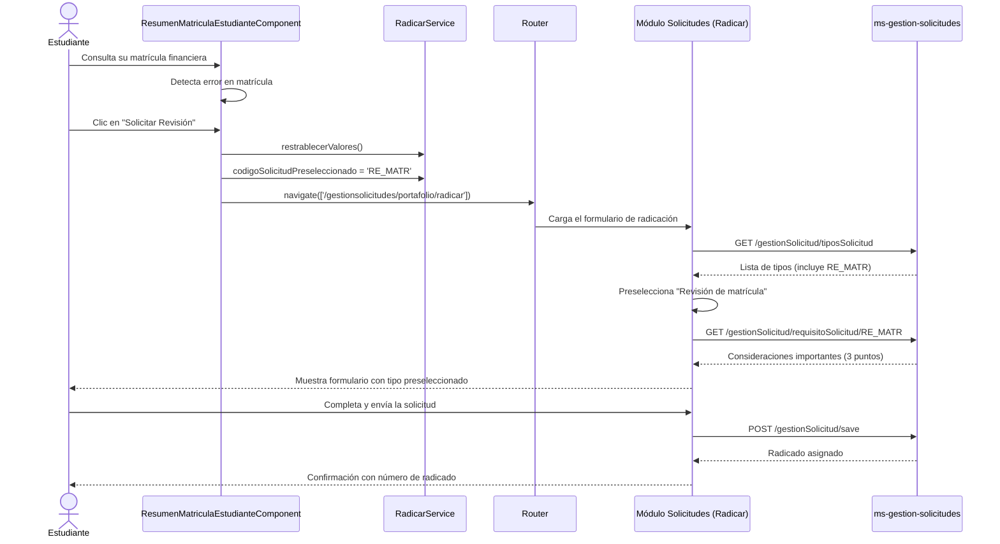

# Documentación Técnica — Solicitud de Revisión de Matrícula (RE_MATR)

**Proyecto:** Sistema de Gestión de Maestría en Computación
**Funcionalidad:** Nueva solicitud: Revisión de Matrícula
**Código de solicitud:** `RE_MATR`
**Fecha de implementación:** 2026-05-05
**Autor:** Daniel Felipe Contreras Tobar (Frontend)

---

## 1. Descripción General

Se implementó una nueva funcionalidad que permite a los **estudiantes** solicitar una revisión de su matrícula financiera o académica directamente desde el módulo de Gestión de Matrícula Financiera del frontend Angular.

Esta funcionalidad conecta dos módulos del sistema:
- **`gestion-matricula-financiera`** — donde el estudiante consulta su matrícula y detecta el error
- **`gestion-solicitudes`** — donde se radica formalmente la solicitud de revisión

---

## 2. Cambios realizados por capa

### 2.1 Base de datos — `ms-gestion-solicitudes`

Se agregaron dos registros nuevos en la base de datos compartida:

**Script:** `ms-maestriacomputacion-back-info-presupuestaria/Scripts/Nuevo/4.Script_Solicitud_Revision_Matricula.sql`

```sql
-- Nuevo tipo de solicitud
INSERT INTO tipos_solicitudes (nombre, estado, codigo)
VALUES ('Revisión de matrícula', 'ACTIVO', 'RE_MATR');

-- Requisitos informativos que ve el estudiante antes de radicar
INSERT INTO requisitos_solicitud (titulo_documento, descripcion, articulo, tener_en_cuenta, id_tipo_solicitud)
VALUES (
    'Consideraciones importantes antes de solicitar una revisión:',
    'I. Antes de solicitar una revisión, es necesario verificar que toda la información
     en el apartado "MATRÁCULAS" sea correcta.
     II. Si la matrícula aún no ha sido generada y se considera que esto es un error,
     se puede solicitar una revisión.
     III. En caso de identificar un error en la matrícula académica o financiera,
     se puede proceder con la solicitud de revisión.',
    NULL,
    NULL,
    (SELECT id FROM tipos_solicitudes WHERE codigo = 'RE_MATR')
);
```

**Tablas afectadas:**

| Tabla | Operación | Descripción |
|-------|-----------|-------------|
| `tipos_solicitudes` | INSERT | Nuevo tipo con código `RE_MATR`, estado `ACTIVO` |
| `requisitos_solicitud` | INSERT | Texto informativo con 3 consideraciones para el estudiante |

---

### 2.2 Backend de solicitudes — `ms-gestion-solicitudes`

Se actualizó el enum `ABREVIATURA_SOLICITUD.java` para incluir el nuevo código:

```java
// Antes — el enum no tenía RE_MATR
// Después — se agregó al final del enum:
RE_MATR("Revisión de Matrícula");
```

**Archivo modificado:**
`ms-gestion-solicitudes/src/main/java/com/maestria/gestionSolicitudes/comun/enums/ABREVIATURA_SOLICITUD.java`

Este enum es usado por el backend para identificar y procesar los tipos de solicitud. Al agregar `RE_MATR`, el sistema de solicitudes reconoce el nuevo tipo y puede procesarlo a través del flujo estándar de radicación.

**No se requirieron cambios adicionales en el backend** porque el flujo de radicación es genérico — el endpoint `POST /gestionSolicitud/save` acepta cualquier tipo de solicitud registrado en la tabla `tipos_solicitudes`.

---

### 2.3 Frontend Angular — `ms-maestriacomputacion-front`

#### Componente modificado: `ResumenMatriculaEstudianteComponent`

**Archivo:** `src/app/modules/gestion-matricula-financiera/feature/resumen-matricula-estudiante/resumen-matricula-estudiante.component.ts`

El componente fue **rediseñado** con las siguientes mejoras respecto a la versión anterior:

**Cambios principales:**
1. **Carga del período académico activo** — ahora carga primero los períodos y muestra el período activo como badge en el header
2. **Manejo de error 404 mejorado** — ya no redirige al listado si el estudiante no tiene matrícula; muestra un estado vacío informativo
3. **Botón "Solicitar Revisión" siempre visible** — aparece tanto si hay datos como si no, para que el estudiante siempre tenga una vía de acción
4. **Getter `getPeriodoLabel()`** — construye el label del período sin usar caracteres no-ASCII en el template (fix de compatibilidad con el compilador Angular)

```typescript
// Flujo actualizado: primero períodos, luego estudiante
cargarDatosIniciales(): void {
    this.facadeService.obtenerPeriodosAcademicos().pipe(...).subscribe({
        next: (periodos) => {
            if (periodos?.length > 0) {
                this.periodoActual = periodos[0];  // ← nuevo: muestra período en header
                this.facadeService.setPeriodoFiltro(this.periodoActual);
            }
            // luego carga el estudiante...
        }
    });
}

// Error 404: ya no redirige, muestra estado vacío
cargarEstudiante(id: string): void {
    this.facadeService.obtenerEstudiante(id).pipe(...).subscribe({
        error: (_err) => {
            this.estudiante = null;  // ← muestra estado vacío + botón revisión
            this.loadingService.hide();
            this.cdr.markForCheck();
        }
    });
}

// Getter para evitar 'ñ' en expresiones de binding del template
getPeriodoLabel(): string {
    if (!this.periodoActual) return '';
    const anio = this.periodoActual.año ?? this.periodoActual.tagPeriodo ?? '';
    const periodo = this.periodoActual.periodo ?? this.periodoActual.tagPeriodo ?? '';
    return `${anio}-${periodo}`;
}

solicitarRevision(): void {
    this.radicarService.restrablecerValores();
    this.radicarService.codigoSolicitudPreseleccionado = 'RE_MATR';
    this.router.navigate(['/gestionsolicitudes/portafolio/radicar']);
}
```

**Template actualizado** — estructura de la pantalla:
```html
<!-- Header con período académico activo -->
<div class="mb-4 pb-3 border-bottom-1 surface-border flex justify-content-between align-items-center">
    <h2>Mi Matrícula Financiera</h2>
    <p-tag *ngIf="periodoActual" [value]="getPeriodoLabel()" severity="info" icon="pi pi-calendar"></p-tag>
</div>

<!-- Datos del estudiante (si existen) -->
<div *ngIf="estudiante">
    <app-tabla-matricula-estudiante [estudiante]="estudiante"></app-tabla-matricula-estudiante>
</div>

<!-- Estado vacío (si no hay datos o hay error) -->
<div *ngIf="!estudiante">
    <i class="pi pi-exclamation-circle"></i>
    <span>Información no disponible</span>
</div>

<!-- Botón SIEMPRE visible -->
<div class="bg-blue-50 border-round mt-3 p-3">
    <span>Si tienes dudas sobre tu costo o no aparece tu información, solicita una revisión.</span>
    <button pButton label="Solicitar Revisión" icon="pi pi-send" (click)="solicitarRevision()"></button>
</div>
```

**Dependencias inyectadas en el componente:**

| Servicio | Propósito |
|---------|-----------|
| `RadicarService` | Gestiona el estado del formulario de radicación y preselecciona el tipo |
| `Router` | Navega al módulo de solicitudes |
| `GestionMatriculaFinancieraFacadeService` | Carga los datos de matrícula del estudiante |
| `AutenticacionService` | Obtiene el código del estudiante autenticado |

#### Template modificado: `resumen-matricula-estudiante.component.html`

Se agregó el botón "Solicitar Revisión" en la sección de acciones:

```html
<div class="flex flex-column md:flex-row align-items-center justify-content-between gap-3 mt-3">
    <div class="flex align-items-center gap-2 text-500">
        <i class="pi pi-info-circle"></i>
        <span class="text-sm">
            Si encuentras algún inconveniente con tu matrícula,
            puedes solicitar una revisión.
        </span>
    </div>
    <button pButton pRipple
        type="button"
        label="Solicitar Revisión"
        icon="pi pi-send"
        class="p-button-outlined flex-shrink-0"
        (click)="solicitarRevision()">
    </button>
</div>
```

#### Servicio utilizado: `RadicarService`

**Archivo:** `src/app/modules/gestion-solicitudes/services/radicar.service.ts`

El `RadicarService` ya existía en el proyecto. Se utilizó la propiedad `codigoSolicitudPreseleccionado` para pasar el código `RE_MATR` al flujo de radicación, y el método `restrablecerValores()` para limpiar cualquier estado previo.

Se agregó también el `FormGroup` para la revisión de matrícula en el servicio:

```typescript
formRevisionMatricula: FormGroup = new FormGroup({});
```

Y se incluyó en el método `restrablecerValores()`:

```typescript
this.formRevisionMatricula = new FormGroup({});
```

---

## 3. Flujo completo de la funcionalidad



---

## 4. Ruta de acceso

| Ruta | Componente | Rol requerido |
|------|-----------|---------------|
| `/gestion-matricula-financiera/resumen` | `ResumenMatriculaEstudianteComponent` | `ROLE_ESTUDIANTE` |
| `/gestion-matricula-financiera/resumen/:id` | `ResumenMatriculaEstudianteComponent` | `ROLE_ESTUDIANTE` |

El botón "Solicitar Revisión" solo es visible para estudiantes autenticados con `ROLE_ESTUDIANTE`.

---

## 5. Catálogo de tipos de solicitud actualizado

Con la adición de `RE_MATR`, el catálogo completo de tipos de solicitud activos queda:

| Código | Nombre | Estado | Módulo origen |
|--------|--------|--------|---------------|
| `AD_ASIG` | Adición de asignaturas | ACTIVO | Solicitudes |
| `CA_ASIG` | Cancelación de asignaturas | ACTIVO | Solicitudes |
| `HO_ASIG_ESP` | Homologación asignaturas especialización | ACTIVO | Solicitudes |
| `HO_ASIG_POS` | Homologación asignaturas postgrados | ACTIVO | Solicitudes |
| `AP_SEME` | Aplazamiento de semestre | ACTIVO | Solicitudes |
| `CU_ASIG` | Cursar asignaturas en otros programas | ACTIVO | Solicitudes |
| `AV_PASA_INV` | Aval para realizar pasantía de investigación | ACTIVO | Solicitudes |
| `AP_ECON_INV` | Apoyo económico para estancias de investigación | ACTIVO | Solicitudes |
| `RE_CRED_PAS` | Reconocimiento de créditos por pasantías | ACTIVO | Solicitudes |
| `RE_CRED_PR_DOC` | Reconocimiento de créditos práctica docente | ACTIVO | Solicitudes |
| `RE_CRED_PUB` | Reconocimiento de créditos por publicaciones | ACTIVO | Solicitudes |
| `AP_ECON_ASI` | Apoyo económico para asistencia a congresos | ACTIVO | Solicitudes |
| `PA_PUBL_EVE` | Apoyo económico pago publicación/evento | ACTIVO | Solicitudes |
| `AV_COMI_PR` | Aval para actividades de práctica docente | ACTIVO | Solicitudes |
| `SO_BECA` | Solicitud Beca/Descuento | ACTIVO | Solicitudes |
| `SO_OTRA` | Otra | ACTIVO | Solicitudes |
| `CER_VOTO` | Registro de certificado de votación | ACTIVO | Solicitudes |
| **`RE_MATR`** | **Revisión de matrícula** | **ACTIVO** | **Matrícula Financiera** ← nuevo |

---

## 6. Consideraciones de diseño

### Por qué se usó el flujo existente de radicación

En lugar de crear un formulario nuevo específico para la revisión de matrícula, se reutilizó el flujo genérico de radicación del módulo `gestion-solicitudes`. Esto tiene varias ventajas:

1. **Consistencia:** El estudiante usa el mismo flujo que para cualquier otra solicitud
2. **Mantenimiento:** No hay código duplicado — el formulario de radicación ya maneja todos los tipos
3. **Trazabilidad:** La solicitud queda registrada en el sistema de solicitudes con número de radicado, historial de estados y notificaciones por correo
4. **Cero cambios en el backend de solicitudes:** Solo se agregó el tipo en la BD y el enum — el flujo de procesamiento es idéntico al de otras solicitudes

### Por qué `codigoSolicitudPreseleccionado`

El `RadicarService` tiene la propiedad `codigoSolicitudPreseleccionado` que permite que el formulario de radicación cargue directamente con el tipo de solicitud ya seleccionado. Esto mejora la UX del estudiante — no tiene que buscar "Revisión de matrícula" en la lista de tipos.

---

## 7. Resumen de archivos modificados/creados

| Archivo | Tipo | Cambio |
|---------|------|--------|
| `Scripts/Nuevo/4.Script_Solicitud_Revision_Matricula.sql` | SQL nuevo | INSERT en `tipos_solicitudes` y `requisitos_solicitud` |
| `ms-gestion-solicitudes/.../ABREVIATURA_SOLICITUD.java` | Java modificado | Agregado `RE_MATR("Revisión de Matrícula")` al enum |
| `gestion-matricula-financiera/.../resumen-matricula-estudiante.component.ts` | TypeScript modificado | Rediseño completo: carga período activo, manejo de 404 sin redirección, `getPeriodoLabel()`, `solicitarRevision()` |
| `gestion-matricula-financiera/.../resumen-matricula-estudiante.component.html` | HTML modificado | Header con badge de período, estado vacío informativo, botón "Solicitar Revisión" siempre visible |
| `gestion-solicitudes/services/radicar.service.ts` | TypeScript modificado | Agregado `formRevisionMatricula` y limpieza en `restrablecerValores()` |
