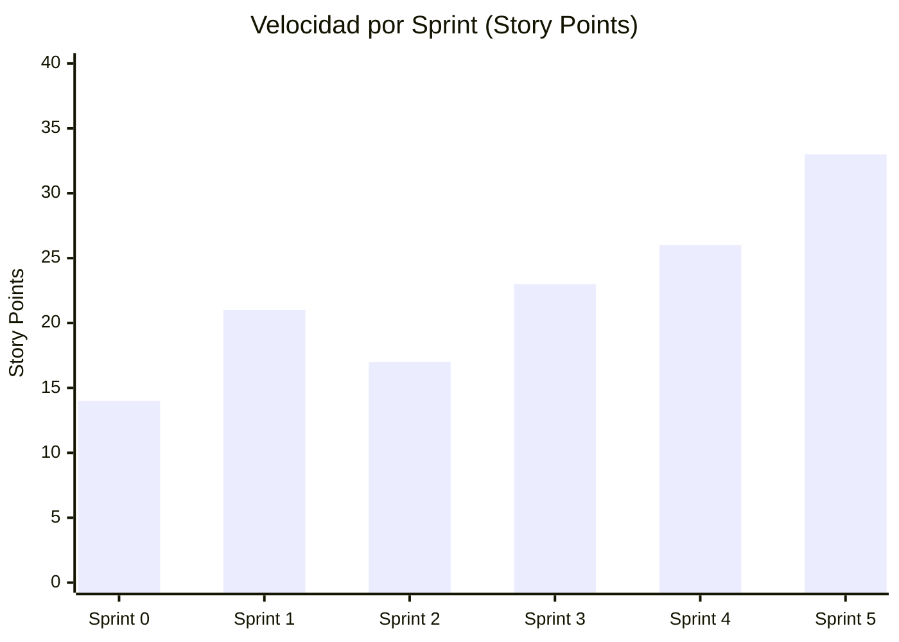
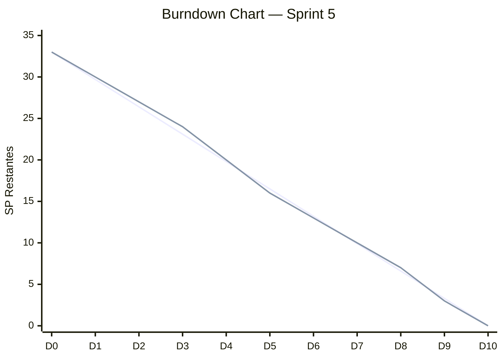

# Métricas de Velocidad — Sprints

**Proyecto:** ms-maestriacomputacion-front
**Fecha:** 2026-05-04

---

## Velocidad por Sprint

| Sprint | Objetivo | SP Comprometidos | SP Completados | Velocidad | Historias Done |
|--------|----------|-----------------|----------------|-----------|----------------|
| Sprint 0 | Setup y arquitectura base | 14 | 14 | 100% | 7/7 tareas |
| Sprint 1 | Listado y filtros de matrícula | 21 | 21 | 100% | HU-001, HU-002, HU-003, HU-004 |
| Sprint 2 | Detalle y resumen de matrícula | 17 | 17 | 100% | HU-005, HU-006, HU-007 |
| Sprint 3 | Reporte final y proyección (base) | 23 | 23 | 100% | HU-008, HU-009, HU-010 |
| Sprint 4 | Edición de proyección y grupos | 26 | 26 | 100% | HU-011, HU-012, HU-013, HU-014, HU-015, HU-016, HU-017, HU-018 |
| Sprint 5 | Gastos, Excel, tests y docs | 33 | 33 | 100% | HU-019, HU-020, HU-021, HU-022 |
| **Total** | | **134** | **134** | **100%** | **22/22 HU** |

---

## Velocidad Promedio

- **Sprints de desarrollo (1-5):** 24 SP/sprint promedio
- **Tendencia:** Creciente — el equipo ganó velocidad conforme avanzó el proyecto

---

## Diagrama de Velocidad

---

## Burndown Chart — Sprint 5 (ejemplo)

| Día | SP Restantes Ideal | SP Restantes Real |
|-----|-------------------|-------------------|
| Día 0 | 33 | 33 |
| Día 1 | 29.7 | 30 |
| Día 2 | 26.4 | 27 |
| Día 3 | 23.1 | 24 |
| Día 4 | 19.8 | 20 |
| Día 5 | 16.5 | 16 |
| Día 6 | 13.2 | 13 |
| Día 7 | 9.9 | 10 |
| Día 8 | 6.6 | 7 |
| Día 9 | 3.3 | 3 |
| Día 10 | 0 | 0 |

*(Línea 1 = ideal, Línea 2 = real)*

---

## Happiness Index

| Sprint | Director | Backend | Frontend | Promedio |
|--------|----------|---------|----------|----------|
| Sprint 0 | 4 | 4 | 4 | 4.0 |
| Sprint 1 | 4 | 4 | 4 | 4.0 |
| Sprint 2 | 4 | 4 | 5 | 4.3 |
| Sprint 3 | 5 | 4 | 4 | 4.3 |
| Sprint 4 | 4 | 5 | 4 | 4.3 |
| Sprint 5 | 5 | 5 | 5 | 5.0 |
| **Promedio** | **4.3** | **4.3** | **4.3** | **4.3** |

**Tendencia:** Positiva — el equipo terminó el proyecto con alta satisfacción.

---

## Análisis

El equipo mantuvo una velocidad consistente durante todo el proyecto. Los sprints más complejos (Sprint 4 y 5) tuvieron mayor cantidad de SP pero se completaron al 100% gracias a:

1. **Estimaciones realistas** — el equipo aprendió a estimar mejor en los primeros sprints
2. **Arquitectura clara** — el Pattern B hexagonal redujo la ambigüedad en la implementación
3. **Comunicación directa** — al ser un equipo de 3 personas, los impedimentos se resolvieron rápidamente
